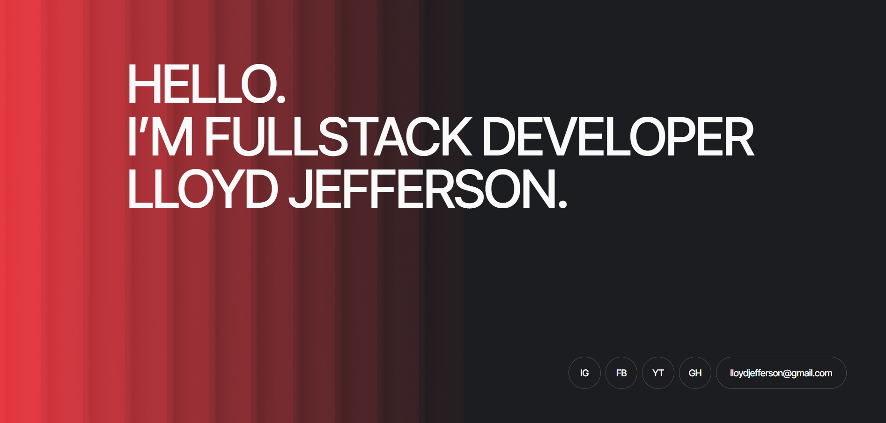

## Hi there! 👋 I'm Mykola

I'm a full-stack developer specializing in the **MERN stack**:  
**JavaScript**, **React**, **Express**, and **MongoDB**.

🌱 Once upon a time, I dreamed of living in Zanzibar and eating mangoes every day.  
But for now, I'm writing code and building projects.😊

### 🚀 My Current Projects:
- **🛒 Market** – An e-commerce application with dynamic product management.
  [🔗 GitHub Repository](https://github.com/NikolayPutyata/Product-Shop-Ex) | [🌐 Live Demo](https://product-shop-kqk72qfl7-nikolayputyatas-projects.vercel.app/)
  

- **🖥️ Lloyd Jeffersonr's portfolio** – Personal portfolio for developer.  
  [🔗 GitHub Repository](https://github.com/TOR10S/script-masters) | [🌐 Live Demo](https://tor10s.github.io/script-masters/)

